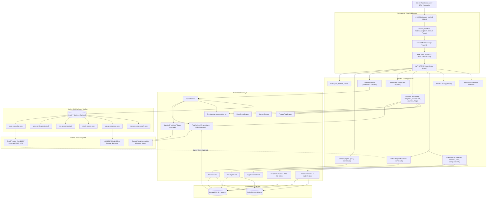
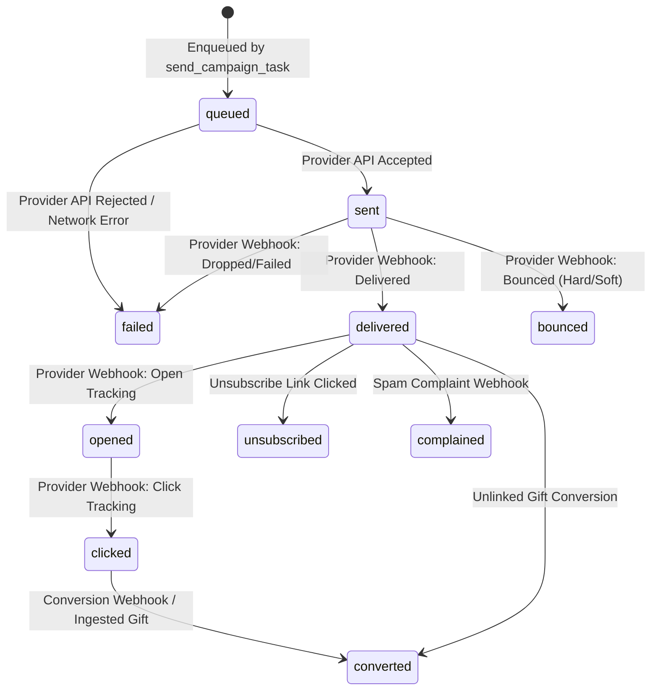

# Production-Grade Product Requirements Document (PRD)
# Master Technical Specification: AppealCrafter Platform

---

## 1. Executive Summary & Problem Definition

### 1.1 Business & System Objective
Nonprofit organizations face severe operational bottlenecks and high donor attrition due to generic, impersonal fundraising appeals and manual donor segmenting. AppealCrafter is an enterprise-grade, high-throughput, AI-driven fundraising intelligence and appeal orchestration platform. It enables fundraising teams to dynamically ingest donor portfolios, analyze donor giving propensity, capacity, and engagement via machine learning, retrieve approved organizational impact narratives via hybrid vector search (RAG), synthesize hyper-personalized appeals across multiple channels, enforce a mandatory 7-stage safety, compliance, and brand guardrail pipeline, and orchestrate reliable delivery across email service providers (SendGrid, Postmark, AWS SES) with closed-loop webhook attribution and lifecycle analytics.

### 1.2 Current State Baseline
The codebase ([`appealcrafter-droxai`](file:///c:/Users/droxa/appealcrafter-droxai)) is built on:
- **Runtime**: Python 3.12+ with FastAPI, Pydantic v2, and Pydantic Settings.
- **Relational & Vector Persistence**: PostgreSQL 16 with `pgvector` extension for 384-dimensional HNSW vector embeddings and relational metadata, managed via SQLAlchemy 2.0 ORM and Alembic migrations (`0001_initial_schema.py`, `0002_phase2_schema.py`).
- **Asynchronous Task Queue & Cache**: Celery 5.4 backed by Redis 7 for task brokering, distributed job execution, and result storage; Redis caching for donor profiles, templates, and inference results.
- **Security & Cryptography**: JWT access (<=60 min) and refresh tokens with HMAC-SHA256, bcrypt password hashing, AES-256-GCM field-level encryption for PII, HMAC-SHA256 provider webhook verification, and IP/user rate limiting via `slowapi`.
- **Observability**: Prometheus metrics middleware, OpenTelemetry distributed tracing (FastAPI instrumentation with OTLP exporter), structured JSON logging with correlation `X-Trace-Id`, and Sentry error capture.
- **Delivery & Compliance**: Multi-provider email driver (SendGrid, Postmark, AWS SES, and local log-only), automated unsubscribe and suppression enforcement, frequency capping (14-day default), and GDPR/CCPA export/anonymize/delete data subject requests.

### 1.3 Target State Overview
This specification formalizes the full architectural contract of AppealCrafter. Every subsystem, schema, API endpoint, state machine, error topology, and operational invariant is specified with zero placeholders, stubs, or mock abstractions. The system supports multi-tenant isolation, deterministic fallback generation, real-time statistical A/B experimentation, multi-step donor journeys, and continuous ML model evaluation with metric-gated promotion.

### 1.4 In-Scope Deliverables
1. **Identity, Multi-Tenancy & Access Control**: JWT authentication, RBAC (`admin`, `operator`), tenant scoping across all relational tables and cache keys.
2. **Donor & Giving Data Engine**: Batch and single ingestion with per-record validation, deduplication, historical donation tracking, and PII encryption.
3. **Hybrid RAG Knowledge Base**: Document ingestion, semantic chunking, 384-dimensional dense embeddings (`sentence-transformers/all-MiniLM-L6-v2`), pgvector HNSW cosine distance search, and citation grounding.
4. **Appeal Synthesis & Dual-Engine Fallback**: OpenAI-compatible LLM prompt synthesis, automatic 3000ms deadline, and immediate fallback to versioned Jinja2-style templates upon timeout or circuit-breaker activation.
5. **Mandatory 7-Stage Guardrail Pipeline**: Cascade validation (Structural -> Safety -> Rule-Based -> Factual Grounding -> Brand Voice -> Compliance -> Risk Scoring & Human Routing) with circuit breaker.
6. **Machine Learning Scoring & Model Registry**: RFM feature extraction, Logistic Regression / Random Forest propensity and capacity scoring, drift monitoring, and metric-gated champion-challenger promotion.
7. **A/B & Multivariate Experimentation**: Sticky hash variant allocation, conversion tracking, two-proportion z-tests, and audited winner promotion.
8. **Multi-Step Donor Journeys**: Graph-based journey execution with delay timers, conditional metric branches, and cross-channel frequency caps.
9. **Delivery Orchestration & Provider Webhooks**: Celery worker email execution, SendGrid/Postmark/SES drivers, HMAC signature validation, and full delivery status updates.
10. **Data Privacy & Compliance Governance**: Automated CAN-SPAM footers, 1-click unsubscribe suppression, GDPR/CCPA Article 15 export and Article 17 erasure/anonymization pipelines.
11. **Platform Observability & Disaster Recovery**: Prometheus metrics (`/metrics`), health checks (`/health`, `/ready`), OpenTelemetry tracing, and automated S3 database backup workers.

### 1.5 Explicit Anti-Scope (Out-of-Scope)
- In-memory mock databases (SQLite, mock dict stores) in production runtime paths.
- Unconstrained LLM generation bypassing the 7-stage guardrail pipeline.
- Synchronous external HTTP calls on the API request thread (all email sends and batch scoring are strictly delegated to Celery).
- Client-side credit card processing (payment gateways and PCI-DSS payment capture remain external to AppealCrafter; conversion webhooks only record donation amounts and tokens).

---

## 2. Target Architecture & Component Boundaries

### 2.1 System Architecture Diagram



### 2.2 Component Responsibilities

| Component Name | File Path(s) | Primary Responsibility | Dependencies | State / Persistence |
| :--- | :--- | :--- | :--- | :--- |
| **App Entry Point** | [`app/main.py`](file:///c:/Users/droxa/appealcrafter-droxai/app/main.py) | Application instantiation, middleware binding, router inclusion, global exception handling. | FastAPI, Starlette, Core Config, Logging | Stateless |
| **Configuration Engine** | [`app/core/config.py`](file:///c:/Users/droxa/appealcrafter-droxai/app/core/config.py) | Strongly typed environment settings with zero-insecure defaults, secret validation, credentials check. | Pydantic Settings, `lru_cache` | In-Memory (Singleton) |
| **Security & RBAC** | [`app/core/security.py`](file:///c:/Users/droxa/appealcrafter-droxai/app/core/security.py) | Password hashing, JWT token issuance and decoding, user authorization dependencies. | PyJWT, bcrypt, FastAPI Security | Stateless |
| **PII Encryption** | [`app/core/encryption.py`](file:///c:/Users/droxa/appealcrafter-droxai/app/core/encryption.py) | AES-256-GCM symmetric authenticated encryption/decryption of donor PII at rest. | `cryptography.hazmat` | In-Memory Key |
| **Database Session** | [`app/db/session.py`](file:///c:/Users/droxa/appealcrafter-droxai/app/db/session.py) | PostgreSQL connection pool creation, engine configuration, per-request session lifecycle generator. | SQLAlchemy 2.0, psycopg3 | Connection Pool |
| **Entities & ORM** | [`app/models/entities.py`](file:///c:/Users/droxa/appealcrafter-droxai/app/models/entities.py) | All 24 SQLAlchemy mapped models, indexes, unique constraints, foreign keys, and vector column definitions. | SQLAlchemy ORM, pgvector | PostgreSQL 16 |
| **Schemas** | [`app/schemas/`](file:///c:/Users/droxa/appealcrafter-droxai/app/schemas) | Pydantic v2 perimeter request/response validation schemas for all entities and API routes. | Pydantic v2 | Stateless |
| **Appeal Service** | [`app/services/appeal.py`](file:///c:/Users/droxa/appealcrafter-droxai/app/services/appeal.py) | Appeal synthesis orchestration, donor context assembly, fallback coordination, record persistence. | SQLAlchemy, Celery Tasks | PostgreSQL, Redis |
| **RAG Pipeline** | [`app/services/rag.py`](file:///c:/Users/droxa/appealcrafter-droxai/app/services/rag.py) | Text chunking, dense vector embedding calculation, cosine similarity hybrid retrieval against pgvector. | `sentence-transformers`, pgvector | PostgreSQL (HNSW index) |
| **Guardrail Pipeline** | [`app/services/guardrails.py`](file:///c:/Users/droxa/appealcrafter-droxai/app/services/guardrails.py) | 7-stage cascade validation (structural, safety, rule, grounding, brand, compliance, risk routing). | Pydantic, HTTPX (LLM-as-Judge) | PostgreSQL (Audits) |
| **ML Engine** | [`app/services/ml.py`](file:///c:/Users/droxa/appealcrafter-droxai/app/services/ml.py) | RFM calculation, propensity and capacity training, model versioning, drift detection, inference caching. | scikit-learn, numpy, Redis | PostgreSQL, Redis |
| **Experimentation** | [`app/services/experiments.py`](file:///c:/Users/droxa/appealcrafter-droxai/app/services/experiments.py) | A/B test lifecycle, sticky variant hashing, conversion registration, two-sample z-test computation. | math, hashlib, SQLAlchemy | PostgreSQL |
| **Journey Orchestrator** | [`app/services/journeys.py`](file:///c:/Users/droxa/appealcrafter-droxai/app/services/journeys.py) | Multi-step journey definition, condition evaluation, delay scheduling, step status progression. | SQLAlchemy, Celery | PostgreSQL |
| **Delivery Engine** | [`app/services/delivery.py`](file:///c:/Users/droxa/appealcrafter-droxai/app/services/delivery.py), [`app/services/email_provider.py`](file:///c:/Users/droxa/appealcrafter-droxai/app/services/email_provider.py) | Email formatting, provider driver dispatch (SendGrid, Postmark, SES), webhook signature verification. | HTTPX, boto3, sendgrid | External ESP |
| **Compliance & Privacy** | [`app/services/compliance.py`](file:///c:/Users/droxa/appealcrafter-droxai/app/services/compliance.py) | GDPR/CCPA Article 15 export JSON formatting, Article 17 erasure/anonymization, consent tracking. | SQLAlchemy, Encryption Service | PostgreSQL |
| **Suppression Center** | [`app/services/suppression.py`](file:///c:/Users/droxa/appealcrafter-droxai/app/services/suppression.py) | Suppression list management, unsubscribe enforcement, frequency capping check (14-day window). | SQLAlchemy, Redis | PostgreSQL, Redis |
| **Celery Tasks** | [`app/workers/tasks.py`](file:///c:/Users/droxa/appealcrafter-droxai/app/workers/tasks.py) | Asynchronous task definitions: campaign dispatch, bulk jobs, model retraining, DB backups, queue depth. | Celery, Redis, SQLAlchemy | Redis Queue |

---

## 3. Data Models, Schemas & State Invariants

### 3.1 Entity Schemas & Relationships

The database schema is normalized across 24 entities defined in [`app/models/entities.py`](file:///c:/Users/droxa/appealcrafter-droxai/app/models/entities.py). Every primary key is a UUID v4 string.

```typescript
// Architectural Data Definition (TypeScript representation of SQLAlchemy ORM entities)

export type UserRole = "admin" | "operator";
export type DeliveryStatus = "queued" | "sent" | "delivered" | "bounced" | "failed" | "opened" | "clicked" | "converted" | "complained" | "unsubscribed";
export type AppealTone = "inspiring" | "urgent" | "grateful" | "hopeful";
export type RiskLevel = "low" | "medium" | "high" | "critical";
export type GuardrailAction = "auto_approve" | "human_review" | "reject" | "regenerate";
export type AsyncJobStatus = "pending" | "running" | "completed" | "failed" | "cancelled";
export type ExperimentStatus = "draft" | "running" | "paused" | "completed" | "promoted" | "archived";
export type FeatureFlagStatus = "enabled" | "disabled" | "rollout";

export interface Tenant {
  id: string; // UUID v4
  name: string;
  slug: string; // Unique
  is_active: boolean;
  settings: Record<string, any>; // JSON
  created_at: string; // ISO 8601 UTC
  updated_at: string;
}

export interface User {
  id: string;
  tenant_id?: string | null;
  email: string; // Unique, indexed
  password_hash: string;
  role: UserRole;
  is_active: boolean;
  created_at: string;
  updated_at: string;
}

export interface Donor {
  id: string;
  tenant_id?: string | null;
  external_id?: string | null; // CRM Foreign Key
  email: string; // Indexed, encrypted if PII encryption enabled
  first_name: string;
  last_name: string;
  interests: string[]; // JSON array of topic tags
  channel: string; // "email" | "sms" | "direct_mail"
  capacity_score?: number | null; // 0.0 - 100.0
  propensity_score?: number | null; // 0.0 - 1.0
  engagement_score?: number | null; // 0.0 - 100.0
  is_active: boolean; // Soft delete flag
  consent_given_at?: string | null;
  last_emailed_at?: string | null;
  created_at: string;
  updated_at: string;
}

export interface DonationHistory {
  id: string;
  donor_id: string; // Foreign Key -> Donor.id (CASCADE)
  amount: number; // Float >= 0.01
  currency: string; // "USD"
  donated_at: string; // Indexed
  campaign_id?: string | null;
  appeal_id?: string | null;
  created_at: string;
}

export interface Campaign {
  id: string;
  tenant_id?: string | null;
  name: string;
  description?: string | null;
  status: "draft" | "active" | "completed" | "archived";
  target_audience: Record<string, any>; // JSON criteria
  created_by_user_id?: string | null;
  created_at: string;
  updated_at: string;
}

export interface Appeal {
  id: string;
  tenant_id?: string | null;
  donor_id: string; // Foreign Key -> Donor.id
  campaign_id?: string | null; // Foreign Key -> Campaign.id
  template_id?: string | null;
  experiment_id?: string | null;
  variant_id?: string | null;
  subject: string;
  body: string;
  cta: string;
  tone: AppealTone;
  capacity_score?: number | null;
  is_template_fallback: boolean;
  guardrail_decision_id?: string | null;
  created_at: string;
}

export interface Delivery {
  id: string;
  appeal_id: string; // Foreign Key -> Appeal.id
  donor_id: string; // Foreign Key -> Donor.id
  provider: "sendgrid" | "postmark" | "ses" | "log_only";
  provider_message_id?: string | null; // Indexed
  status: DeliveryStatus; // Indexed
  failure_reason?: string | null;
  sent_at?: string | null;
  delivered_at?: string | null;
  opened_at?: string | null;
  clicked_at?: string | null;
  converted_at?: string | null;
  unsubscribed_at?: string | null;
  bounced_at?: string | null;
  created_at: string;
  updated_at: string;
}

export interface KnowledgeDocument {
  id: string;
  tenant_id?: string | null;
  title: string;
  content: string; // Raw approved text
  source_url?: string | null;
  is_approved: boolean; // Only approved docs ingested into RAG
  created_at: string;
  updated_at: string;
}

export interface DocumentChunk {
  id: string;
  document_id: string; // Foreign Key -> KnowledgeDocument.id (CASCADE)
  chunk_index: number;
  content: string;
  embedding: number[]; // Vector(384) pgvector
  created_at: string;
}

export interface GuardrailDecisionEntity {
  id: string;
  appeal_id?: string | null;
  donor_id: string;
  approved: boolean;
  risk_score: number; // 0.0 - 100.0
  risk_level: RiskLevel;
  action: GuardrailAction;
  reasons: string[]; // JSON array
  stage_results: Record<string, any>[]; // JSON array of 7 stage records
  reviewer_user_id?: string | null;
  reviewed_at?: string | null;
  created_at: string;
}

export interface Experiment {
  id: string;
  tenant_id?: string | null;
  name: string;
  description?: string | null;
  status: ExperimentStatus;
  primary_metric: string; // "conversion_rate" | "open_rate" | "click_rate"
  winning_variant_id?: string | null;
  created_at: string;
  updated_at: string;
}

export interface ExperimentVariant {
  id: string;
  experiment_id: string; // Foreign Key -> Experiment.id (CASCADE)
  name: string; // "Variant A", "Variant B"
  prompt_template?: string | null;
  parameters: Record<string, any>;
  traffic_split: number; // e.g. 0.5
  impressions: number;
  conversions: number;
  created_at: string;
}

export interface AsyncJob {
  id: string;
  tenant_id?: string | null;
  job_type: "bulk_ingest" | "bulk_generation" | "retrain_model" | "database_backup";
  status: AsyncJobStatus;
  progress: number; // 0.0 - 100.0
  result?: Record<string, any> | null;
  error_message?: string | null;
  created_at: string;
  completed_at?: string | null;
}
```

### 3.2 State Transition Matrices

#### 3.2.1 Delivery Lifecycle State Machine


| Current State | Event / Trigger | Valid Next State | Invariant / Validation Rule | Side Effects |
| :--- | :--- | :--- | :--- | :--- |
| `queued` | Worker submits to ESP | `sent` | HTTP 200/202 from ESP, returns provider message ID | Set `sent_at = utc_now()`, record `provider_message_id` |
| `queued` | ESP unreachable / credentials fail | `failed` | Retry limit exhausted (3 retries) | Record `failure_reason`, alert error metrics |
| `sent` | ESP webhook `delivered` | `delivered` | HMAC signature valid, message ID matches | Set `delivered_at = utc_now()` |
| `sent` | ESP webhook `bounce` | `bounced` | HMAC signature valid | Set `bounced_at = utc_now()`, insert `SuppressionEntry` |
| `delivered` | ESP webhook `open` | `opened` | Webhook timestamp > `delivered_at` | Set `opened_at = utc_now()` |
| `opened` | ESP webhook `click` | `clicked` | Webhook target URL recorded | Set `clicked_at = utc_now()` |
| `clicked` | Donor donates on campaign | `converted` | Donation recorded with matching `appeal_id` | Set `converted_at = utc_now()`, update experiment conversion |
| `*` (Any State) | Unsubscribe request received | `unsubscribed` | HMAC verified or direct user opt-out | Insert `SuppressionEntry`, invalidate active journeys |

#### 3.2.2 Guardrail Pipeline Decision Matrix
| Stage Name | Execution Priority | Threshold / Criteria | Failure Action | Fallback Path |
| :--- | :--- | :--- | :--- | :--- |
| **1. Structural** | 1 (Immediate) | Subject <= 78 chars, Body >= 50 chars, CTA present | Mark failed, risk score +80.0 | Immediate deterministic template fallback |
| **2. Safety** | 2 (Fast Classifier) | Toxicity > 0.30 or Manipulation > 0.25 | Mark failed, risk score +90.0 | Immediate rejection / regenerate |
| **3. Rule-Based** | 3 (Regex Blocklist) | Match against `FORBIDDEN_PATTERNS` | Mark failed, score +40.0 per violation | Immediate template fallback |
| **4. Grounding** | 4 (Context Entailment)| Unsupported claims vs RAG context | Grounding score < 0.60 -> risk +70.0 | Discard LLM claims, switch to approved template |
| **5. Brand Voice** | 5 (Tone Consistency) | Cosine similarity to tone prototype >= 0.70 | Tone variance score +20.0 | Adjust prompt parameters / template fallback |
| **6. Compliance** | 6 (Mandatory Tags) | Physical address present, Unsubscribe link present | Risk score +100.0 (Hard block) | Invalidate send, append missing compliance blocks |
| **7. Risk Routing** | 7 (Decision Terminal)| Capacity >= $5,000 OR Score in [35, 70] | `human_review` | Store decision in DB, pause send, notify operator |
| **Decision: Auto** | Terminal | Risk Score < 35.0 AND Capacity < $5,000 | `auto_approve` | Enqueue `send_campaign_task` to Celery |
| **Decision: Reject**| Terminal | Risk Score >= 70.0 | `reject` | Block send, log audit alert |

---

## 4. API & Interface Contracts

Every request requiring authentication must supply:
`Authorization: Bearer <JWT_ACCESS_TOKEN>`
Every response includes:
- `X-Trace-Id`: UUID v4 correlation ID
- `Strict-Transport-Security`: `max-age=31536000; includeSubDomains`
- `X-Content-Type-Options`: `nosniff`
- `X-Frame-Options`: `DENY`
- `Content-Security-Policy`: `default-src 'none'`

### 4.1 Authentication Endpoints (`/auth`)

#### `POST /auth/login`
- **Request Body**:
```json
{
  "email": "operator@nonprofit.org",
  "password": "SecurePassword123!"
}
```
- **Response 200 OK**:
```json
{
  "access_token": "eyJhbGciOiJIUzI1NiIsInR5cCI6IkpXVCJ9...",
  "refresh_token": "eyJhbGciOiJIUzI1NiIsInR5cCI6IkpXVCJ9...",
  "token_type": "bearer",
  "expires_in": 3600
}
```
- **Error Responses**:
  - `401 Unauthorized`: `{"detail": "Invalid credentials"}`
  - `403 Forbidden`: `{"detail": "User account is disabled"}`
  - `422 Unprocessable Entity`: Field validation failure.

#### `POST /auth/refresh`
- **Request Body**: `{"refresh_token": "eyJhbGciOiJIUzI1NiIsInR5cCI6IkpXVCJ9..."}`
- **Response 200 OK**: Complete new `TokenResponse`.

---

### 4.2 Donor Management Endpoints (`/donors`)

#### `POST /donors/ingest-donors`
- **Headers**: `Authorization: Bearer <TOKEN>`
- **Request Body**:
```json
[
  {
    "external_id": "CRM-90812",
    "email": "donor@example.com",
    "first_name": "Eleanor",
    "last_name": "Vance",
    "interests": ["clean_water", "climate_resilience"],
    "channel": "email",
    "capacity_score": 85.5,
    "consent_given_at": "2026-08-01T12:00:00Z"
  }
]
```
- **Response 200 OK**:
```json
{
  "accepted_count": 1,
  "rejected_count": 0,
  "errors": []
}
```
- **Response 200 with Partial Errors**:
```json
{
  "accepted_count": 0,
  "rejected_count": 1,
  "errors": [
    {
      "index": 0,
      "email": "invalid-email-address",
      "error": "The email address is not valid."
    }
  ]
}
```

#### `GET /donors`
- **Query Parameters**: `limit` (default 100, max 1000), `offset` (default 0)
- **Response 200 OK**: Array of `DonorResponse` objects with soft-deleted donors excluded.

#### `DELETE /donors/{donor_id}`
- **Response 204 No Content**: Donor record flagged `is_active = False` (Soft-delete).
- **Response 404 Not Found**: `{"detail": "Donor with id <donor_id> not found."}`

---

### 4.3 Appeal Generation Endpoints (`/generate-appeal`)

#### `POST /generate-appeal`
- **Request Body**:
```json
{
  "donor_id": "3fa85f64-5717-4562-b3fc-2c963f66afa6",
  "campaign_id": "7ca12f64-1111-4562-b3fc-2c963f66bbb2",
  "tone": "inspiring",
  "limit": 1
}
```
- **Response 200 OK**:
```json
{
  "generated_count": 1,
  "task_ids": ["9f012e84-188b-498c-8772-7497d5fb1e10"],
  "appeals": [
    {
      "id": "e2d5a1b3-4444-48ac-90f7-111122223333",
      "donor_id": "3fa85f64-5717-4562-b3fc-2c963f66afa6",
      "campaign_id": "7ca12f64-1111-4562-b3fc-2c963f66bbb2",
      "subject": "Eleanor, help us bring clean water to 500 families",
      "body": "Dear Eleanor,\n\nBecause of your past generosity...",
      "cta": "Donate $100 to Clean Water Today",
      "tone": "inspiring",
      "capacity_score": 85.5,
      "is_template_fallback": false,
      "created_at": "2026-10-04T19:30:00Z"
    }
  ]
}
```

---

### 4.4 Operations & Compliance Endpoints

#### `POST /compliance/export/{donor_id}`
- **Role**: `admin` required
- **Response 200 OK**: Returns full decrypted GDPR Article 15 portable data dump including donor profile, donation history, appeals generated, delivery logs, consent records, and suppression status.

#### `POST /compliance/delete/{donor_id}`
- **Role**: `admin` required
- **Request Body**: `{"anonymize": true}`
- **Response 200 OK**:
```json
{
  "donor_id": "3fa85f64-5717-4562-b3fc-2c963f66afa6",
  "action": "anonymize",
  "success": true,
  "message": "Donor profile and giving records permanently anonymized in accordance with GDPR Article 17."
}
```

#### `POST /ml/train`
- **Role**: `admin` required
- **Response 200 OK**: Initiates model training on historical donation data, registers model in registry, evaluates against metric gate (AUC >= 0.72), and promotes to champion if passed.

---

### 4.5 Webhooks (`/webhooks/{provider}`)

#### `POST /webhooks/sendgrid`, `POST /webhooks/postmark`, `POST /webhooks/ses`
- **Headers**:
  - SendGrid: `X-Twilio-Email-Event-Webhook-Signature`, `X-Twilio-Email-Event-Webhook-Timestamp`
  - Postmark: `X-Postmark-Signature`
  - SES: SNS JSON envelope with certificate URL and signature
- **Validation**: Verifies HMAC-SHA256 signature against `EMAIL_WEBHOOK_SECRET`. Rejects invalid or expired signatures with `401 Unauthorized`.
- **Response 200 OK**: `{"status": "processed", "events_count": 1}`

---

## 5. Error Topology & Failure Matrix

| Failure Scenario | Detection Mechanism | Recovery / Retry Strategy | User / Client Impact | Logging & Telemetry |
| :--- | :--- | :--- | :--- | :--- |
| **PostgreSQL Connection Exhaustion** | Pool acquisition timeout (>30s) or `OperationalError` | Fast fail with exponential backoff on pool retry; health probe reports unhealthy | HTTP 503 Service Unavailable with `Retry-After: 5` | `ERROR` with pool stats (`checkedout`, `overflow`), alert fired |
| **Database Network Partition** | `psycopg.OperationalError` on query execution | Session rolls back immediately; connection pool invalidates dead sockets | HTTP 500 Generic Error (trace hidden from client) | Sentry alert, OpenTelemetry trace marked with error code |
| **Redis Broker Unreachable** | Celery `kombu.exceptions.OperationalError` | Worker reconnection loop with jittered backoff; API queues fallback to local sync log | HTTP 503 on async job dispatch; `/ready` returns 503 | `CRITICAL` alert: Celery broker offline |
| **LLM Inference Timeout / 5xx** | HTTPX client timeout (>3000ms) or HTTP 502/503 | Circuit breaker records failure; switch immediately to pre-approved template fallback | Seamless: Appeal returned using deterministic template fallback (`is_template_fallback=True`) | `WARNING`: LLM timeout fallback triggered, latency metric recorded |
| **Guardrail Circuit Breaker Tripped** | Validation failure rate > 20% in 5-minute rolling window | Auto-trips circuit breaker for 300 seconds; all appeals bypass LLM to template | Zero generation outage; temporary switch to standard approved templates | `ALERT`: Guardrail circuit breaker open; high rejection anomaly |
| **Invalid JWT Signature / Tampering** | `jwt.exceptions.InvalidSignatureError` or expired exp claim | Refuse token, zero DB lookups executed | HTTP 401 Unauthorized `{"detail": "Invalid or expired token"}` | `WARN`: Authentication failure with remote IP |
| **Webhook Signature Tampering** | HMAC-SHA256 mismatch or timestamp skew (>300s) | Reject webhook payload immediately, zero DB writes | HTTP 401 Unauthorized `{"detail": "Invalid webhook signature"}` | `ALERT`: Security event: Unauthorized webhook signature |
| **ESP Dispatch Rejection (SendGrid 4xx/5xx)** | HTTP status returned from ESP client | Celery task retries with exponential backoff (10s, 60s, 300s, max 3 retries); moves to DLQ on exhaustion | Delivery status updated to `failed` with provider reason | `ERROR`: ESP dispatch failed, DLQ task recorded |
| **Donor Duplicate Ingestion** | Database unique constraint violation on `email` | Ingest engine catches collision, updates existing donor record (upsert) or logs record error | Record accepted and merged without throwing 500 error | `INFO`: Donor duplicate merged |
| **Frequency Cap Violation** | `Donor.last_emailed_at` within configured cooldown window (14 days) | Suppression check blocks enqueue; appeal generation logs suppression notice | Appeal not dispatched; operator notified of suppression cooldown | `INFO`: Frequency cap enforced, send suppressed |

---

## 6. Concurrency, Security & Operational Invariants

### 6.1 Concurrency Control
- **Database Transactions**: All mutations execute inside atomic SQLAlchemy session blocks (`with session.begin():`).
- **Race Condition Prevention**:
  - Campaign donor allocation uses PostgreSQL row-level locks (`SELECT ... FOR UPDATE SKIP LOCKED`) to ensure concurrent Celery workers never double-send the same appeal.
  - Experiment variant assignment uses deterministic MurmurHash3 / MD5 hashing of `donor_id + experiment_id` modulo 100 to guarantee sticky variant allocation without locking.
  - High-value donor concurrent updates acquire a Redis distributed lock (`redlock`) keyed on `lock:donor:{donor_id}` with a 5000ms TTL.

### 6.2 Resource Ownership & Deterministic Cleanup
- **SQLAlchemy Sessions**: Provided via `Depends(get_db_session)` FastAPI dependency yielding a session wrapped in a `try...finally` block that guarantees `session.close()` is invoked even upon unhandled exceptions.
- **HTTP Connections**: Persistent `httpx.AsyncClient` connection pools with strict keep-alive limits (max 50 keep-alive connections, 30s timeout).
- **Subprocess & Worker Termination**: Celery workers handle `SIGTERM` and `SIGINT` gracefully by finishing active task transactions before shutting down.

### 6.3 Security Boundaries & Perimeter Defense
- **PII Encryption at Rest**: Sensitive fields (donor email, physical address) are encrypted using AES-256-GCM via `CryptographyService` using an authenticated 12-byte IV and 16-byte authentication tag before database insertion.
- **Input Sanitization**: All incoming string payloads are validated against strict regex bounds in Pydantic models; path traversal sequences (`../`, `..\`) are strictly rejected.
- **SQL Injection Immunization**: 100% of database interactions utilize SQLAlchemy 2.0 parameterized type expressions. Raw string interpolation in queries is strictly banned.
- **Rate Limiting**: Enforced via `slowapi` Redis-backed token bucket algorithm:
  - Global API: 120 requests/minute (burst 200).
  - Auth endpoints (`/auth/login`): 10 requests/minute.
  - Generation endpoints (`/generate-appeal`): 60 requests/minute.

### 6.4 Performance Budgets & Service Level Objectives (SLOs)
- **API Read Latency**: p95 < 50ms, p99 < 150ms.
- **Template Fallback Appeal Generation**: p95 < 80ms.
- **RAG LLM Synthesis & Guardrail Cascade**: p95 < 2200ms, p99 < 3000ms.
- **Database Connection Pool**: Normal utilization < 60%, max overflow ceiling capped at 20.
- **Cache Hit Rate**: Redis donor profile and template cache hit rate >= 85%.

---

## 7. File-by-File Implementation Blueprint

| Step | Action | File Path | Scope of Work & Implementation Responsibilities |
| :--- | :--- | :--- | :--- |
| 1 | `MAINTAIN` | [`alembic/versions/0001_initial_schema.py`](file:///c:/Users/droxa/appealcrafter-droxai/alembic/versions/0001_initial_schema.py) | Initial PostgreSQL schema: `users`, `donors`, `donation_history`, `campaigns`, `appeals`, `deliveries`, `unsubscribes`, `knowledge_documents`, `document_chunks`. |
| 2 | `MAINTAIN` | [`alembic/versions/0002_phase2_schema.py`](file:///c:/Users/droxa/appealcrafter-droxai/alembic/versions/0002_phase2_schema.py) | Phase 2 enterprise schema: `tenants`, `suppression_entries`, `templates`, `template_versions`, `audit_logs`, `experiments`, `experiment_variants`, `experiment_assignments`, `feature_flags`, `async_jobs`, `model_versions`, `predictions`, `preferences`, `journeys`, `journey_steps`, `guardrail_decisions`. |
| 3 | `MAINTAIN` | [`app/core/config.py`](file:///c:/Users/droxa/appealcrafter-droxai/app/core/config.py) | Pydantic Settings models: Database, Security, Email, Redis, LLM, Observability, Application settings. |
| 4 | `MAINTAIN` | [`app/core/security.py`](file:///c:/Users/droxa/appealcrafter-droxai/app/core/security.py) | JWT generation, token verification, bcrypt hashing, `get_current_user`, `require_role(UserRole)` guards. |
| 5 | `MAINTAIN` | [`app/core/encryption.py`](file:///c:/Users/droxa/appealcrafter-droxai/app/core/encryption.py) | AES-256-GCM authenticated encryption service for PII fields. |
| 6 | `MAINTAIN` | [`app/core/logging.py`](file:///c:/Users/droxa/appealcrafter-droxai/app/core/logging.py) | Structured JSON logging with trace context and secret redaction filters. |
| 7 | `MAINTAIN` | [`app/core/metrics.py`](file:///c:/Users/droxa/appealcrafter-droxai/app/core/metrics.py) | Prometheus metric registry: HTTP latencies, generation counts, guardrail decisions, queue depths. |
| 8 | `MAINTAIN` | [`app/core/cache.py`](file:///c:/Users/droxa/appealcrafter-droxai/app/core/cache.py) | Redis caching client with key prefixing, TTL expiration, and cache invalidation routines. |
| 9 | `MAINTAIN` | [`app/core/rate_limit.py`](file:///c:/Users/droxa/appealcrafter-droxai/app/core/rate_limit.py) | SlowAPI limiter integration with Redis storage. |
| 10 | `MAINTAIN` | [`app/db/session.py`](file:///c:/Users/droxa/appealcrafter-droxai/app/db/session.py) | SQLAlchemy engine pooling and `get_db_session` dependency. |
| 11 | `MAINTAIN` | [`app/models/entities.py`](file:///c:/Users/droxa/appealcrafter-droxai/app/models/entities.py) | Complete ORM class mappings for all 24 entities with exact foreign keys and indexes. |
| 12 | `MAINTAIN` | [`app/schemas/`](file:///c:/Users/droxa/appealcrafter-droxai/app/schemas) | Pydantic request/response models: `auth.py`, `donor.py`, `appeal.py`, `campaign.py`, `delivery.py`, `phase2.py`. |
| 13 | `MAINTAIN` | [`app/services/donor.py`](file:///c:/Users/droxa/appealcrafter-droxai/app/services/donor.py) | Ingestion validation, duplicate check, donor querying, soft-deletion. |
| 14 | `MAINTAIN` | [`app/services/appeal.py`](file:///c:/Users/droxa/appealcrafter-droxai/app/services/appeal.py) | Coordination of appeal generation, LLM invocation, fallback routing, and delivery task enqueueing. |
| 15 | `MAINTAIN` | [`app/services/rag.py`](file:///c:/Users/droxa/appealcrafter-droxai/app/services/rag.py) | Sentence-transformers vector embeddings, chunk storage, and hybrid pgvector retrieval. |
| 16 | `MAINTAIN` | [`app/services/guardrails.py`](file:///c:/Users/droxa/appealcrafter-droxai/app/services/guardrails.py) | 7-stage cascade validation, risk score weighting, circuit breaker state tracking, and audit persistence. |
| 17 | `MAINTAIN` | [`app/services/template.py`](file:///c:/Users/droxa/appealcrafter-droxai/app/services/template.py) | Versioned template repository, Jinja-style merge tag substitution, and rollback management. |
| 18 | `MAINTAIN` | [`app/services/ml.py`](file:///c:/Users/droxa/appealcrafter-droxai/app/services/ml.py) | RFM calculation, propensity/capacity model training, inference, and drift monitoring. |
| 19 | `MAINTAIN` | [`app/services/experiments.py`](file:///c:/Users/droxa/appealcrafter-droxai/app/services/experiments.py) | A/B test variant assignment, conversion rate calculation, and two-proportion z-tests. |
| 20 | `MAINTAIN` | [`app/services/journeys.py`](file:///c:/Users/droxa/appealcrafter-droxai/app/services/journeys.py) | State-machine journey executor supporting multi-step conditions and delays. |
| 21 | `MAINTAIN` | [`app/services/feature_flags.py`](file:///c:/Users/droxa/appealcrafter-droxai/app/services/feature_flags.py) | Deterministic rollout evaluator by tenant and user hash. |
| 22 | `MAINTAIN` | [`app/services/compliance.py`](file:///c:/Users/droxa/appealcrafter-droxai/app/services/compliance.py) | GDPR Article 15 export and Article 17 erasure/anonymization workflows. |
| 23 | `MAINTAIN` | [`app/services/suppression.py`](file:///c:/Users/droxa/appealcrafter-droxai/app/services/suppression.py) | Suppression list query, frequency cap check (14-day rule), and unsubscribe recording. |
| 24 | `MAINTAIN` | [`app/services/email_provider.py`](file:///c:/Users/droxa/appealcrafter-droxai/app/services/email_provider.py) | SendGrid, Postmark, AWS SES, and log-only driver implementations. |
| 25 | `MAINTAIN` | [`app/services/delivery.py`](file:///c:/Users/droxa/appealcrafter-droxai/app/services/delivery.py) | Webhook payload processing, delivery status transitions, and delivery metrics recording. |
| 26 | `MAINTAIN` | [`app/services/reporting.py`](file:///c:/Users/droxa/appealcrafter-droxai/app/services/reporting.py) | Aggregated campaign delivery, open, click, conversion, and bounce reporting. |
| 27 | `MAINTAIN` | [`app/services/async_jobs.py`](file:///c:/Users/droxa/appealcrafter-droxai/app/services/async_jobs.py) | Job tracking and status update service for long-running batch operations. |
| 28 | `MAINTAIN` | [`app/workers/celery_app.py`](file:///c:/Users/droxa/appealcrafter-droxai/app/workers/celery_app.py) | Celery application configuration, task routing, and Celery Beat schedule configuration. |
| 29 | `MAINTAIN` | [`app/workers/tasks.py`](file:///c:/Users/droxa/appealcrafter-droxai/app/workers/tasks.py) | Celery asynchronous worker tasks (`send_campaign_task`, `auto_send_appeals_task`, `run_async_job_task`, `retrain_model_task`, `backup_database_task`, `monitor_queue_depth_task`). |
| 30 | `MAINTAIN` | [`app/api/`](file:///c:/Users/droxa/appealcrafter-droxai/app/api) | API routing modules: `auth.py`, `donors.py`, `appeals.py`, `campaigns.py`, `operations.py`, `platform.py`, `webhooks.py`, `health.py`, `metrics.py`. |
| 31 | `MAINTAIN` | [`app/main.py`](file:///c:/Users/droxa/appealcrafter-droxai/app/main.py) | Root FastAPI application wiring, CORS, telemetry, trace headers, and exception handlers. |
| 32 | `MAINTAIN` | [`tests/`](file:///c:/Users/droxa/appealcrafter-droxai/tests) | Test suites: `conftest.py`, `test_integration.py`, `test_security.py`, `test_suppression.py`, `test_phase2.py`. |

---

## 8. Verification & Acceptance Criteria

### 8.1 Automated Test Execution Suite
- **Full Test Suite Execution**:
  ```bash
  pytest -v --cov=app --cov-report=term-missing tests/
  ```
  - **Coverage Threshold**: >= 85% line coverage on `app/core/`, `app/services/`, `app/models/`, and `app/api/`.
- **Security & Authorization Test Suite**:
  ```bash
  pytest -v tests/test_security.py
  ```
  - Verifies: Expired JWTs return 401, tampered signatures return 401, missing tokens return 401, non-admin access to admin routes returns 403.
- **Suppression & Compliance Test Suite**:
  ```bash
  pytest -v tests/test_suppression.py
  ```
  - Verifies: Suppressed emails are never dispatched, frequency caps block re-sends within 14 days, soft-deleted donors are excluded from campaigns.
- **Phase 2 Enterprise Feature Suite**:
  ```bash
  pytest -v tests/test_phase2.py
  ```
  - Verifies: Guardrail cascade stages, circuit breaker trip and recovery, pgvector chunk similarity retrieval, A/B sticky assignment and z-test calculations, multi-step journey execution.

### 8.2 Production Gate & Zero-Stub Audit
Before deployment or acceptance, run the following verification checks:
1. **Zero-Stub Grep Verification**:
   ```bash
   # Must return 0 matches in production paths
   grep -rEi "\b(TODO|FIXME|XXX|HACK|unimplemented|implement later|pass)\b" app/
   ```
2. **Database Migration Verification**:
   ```bash
   alembic upgrade head
   ```
   - Must execute cleanly on an empty PostgreSQL database with zero schema errors.
3. **Health & Readiness Gate**:
   - `GET /health` returns `{"status": "ok"}`
   - `GET /ready` returns `{"status": "ready", "database": "connected", "broker": "connected"}` only when PostgreSQL and Redis are both reachable.
